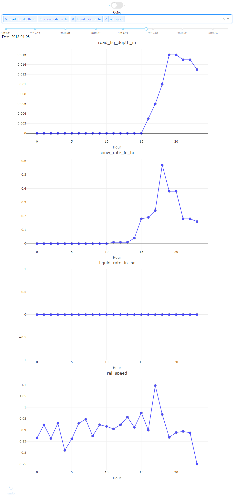

## Multi-Variate Time Series Visualization

Small little visualization of data done in [Plotly Dash](https://dash.plot.ly).

### How to run:
First install requirements:
`pip install -r requirements.txt `

Then just run the python script, `python app.py`

Go to the browser and enter in `localhost:8050` and it should be available.

